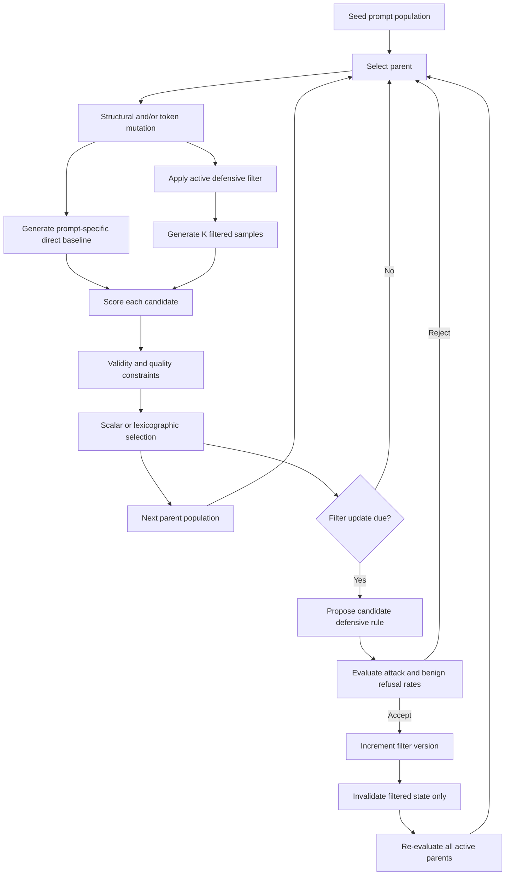

# Architecture and data flow

The main workflow is an Evolution Strategy over prompt mutations. The CMA option
adapts continuous mutation controls and maps them to discrete text operators; it
is CMA-inspired and is not continuous optimization of text.

## State boundaries

- A mutation always clears outputs, metrics, fitness, API-error state, and sample
  records. The child cannot inherit its parent's direct baseline.
- The direct response is generated once per prompt and is deterministic by
  default. K filtered responses represent stochastic evaluation.
- Every evaluation, parent, and filter event is tagged with a filter version.
  Selection never compares stale scores with scores from a newer filter.
- Prompt IDs, parent IDs, seed IDs, generation numbers, and mutation lineage
  make the final candidate traceable to an initial seed.

## Artifact flow

`run_es.py` writes configuration, manifest, lineage, samples, filter versions,
final population, generation aggregates, and an aggregate-only summary.
`experiments/run_ablation.py` writes controlled aggregate run/history tables.
`analysis/analyze_ablation.py` applies the manifest completion rule and
regenerates confidence intervals, effect sizes, exclusions, and convergence
plots without needing raw model text.
